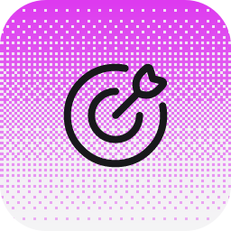

<p align="center">
  <picture>
    <source media="(prefers-color-scheme: dark)" srcset="./icon-dark.png" />
    
  </picture>
</p>

<div align="center">

# Quests

</div>

An auto-detecting todo list surfaced from your chats and activity, tracked as a lightweight quest board.

> **The public home of `ryu-quests`.** Source, builds, and releases live here —
> binaries for every platform are attached to each release.
>
> This tree is generated from the Ryu monorepo, so commits pushed here
> directly are replaced on the next sync. **Pull requests are welcome** —
> open them here and they are ported into the monorepo, then flow back out.
> Ryu as a whole: https://github.com/amajorai/ryu

## Install

**App:** [Install](ryu://apps/@ryu/quests) (opens the Ryu desktop app and asks you to confirm)

**CLI:**

```bash
ryu apps add @ryu/quests
```

**Crate:**

```bash
cargo install ryu-quests
```

Prebuilt binaries for every platform are attached to [each release](https://github.com/amajorai/ryu/releases).

## License

Apache-2.0 — see [LICENSE](./LICENSE).

## Captures are NEVER judged

A capture has no completion condition and stays `status: "open"` forever. If the detection
sweep did not gate on the kind it would judge every kept note **on every tick, forever** —
a model call per item per interval, producing a meaningless verdict each time. Three places
enforce this and must move together:

1. `QuestKind::is_judged` — the single predicate.
2. `judge_quest_with_context` returns `Ok(None)` for a non-task before it reaches a model.
3. `sync_job` / `capture` / `update_quest` skip `sync_backing_job` entirely for a capture —
   not "call it with `open: false`", which would still write a permanently-disabled job row
   per kept item.

`captures_are_never_judged_and_carry_no_backing_job` covers all three.

## Parts

- **`backend/` (`ryu-quests`)** — an extracted Core capability crate: `QuestEngine`, the
  SQLite `QuestStore`, event types, and the `/api/quests/*` HTTP surface. **Now served
  OUT-OF-PROCESS** by the `ryu-quests` bin (`[[bin]]`, `kind:local`, `public_mount`,
  `RYU_QUESTS_BIN`/`RYU_QUESTS_PORT`, default `:7991`); Core links **zero quest code** (no
  path-dep, no `quests` cargo feature). Its three reverse-couplings (the scheduler judge
  run, the `JobTarget::Quest` job lifecycle, and the activity feed) reach the sidecar over
  loopback via `apps/core/src/quests_client.rs`. Everything the engine needs *from* the host
  is inverted through the `QuestsHost` trait, so the crate has **zero dependency on
  `apps/core`**.
- **`ui/` (`@ryu/quests-app`)** — the companion surface: a React app built to one
  self-contained HTML via `vite-plugin-singlefile`, consuming `@ryu/ui`. Shipped as a
  full-page Companion (Path B, `ui_format: "html"`).

## Manifest

- **id** `@ryu/quests` · companion `Quests` (icon `target`).
- **grant** `quests:crud` — the bridge capability the UI drives Core's `/api/quests/*`
  through.
- **permission levels** `quests.view` ⊂ `quests.edit` ⊂ `quests.capture`. Capture is its
  own level because keeping text selected in *another* app is a wider reach than editing
  the board.
- **contributes** a declarative `quest-board` `list-detail` view (GET `/api/quests`, a
  `Complete` item action) for hosts that render manifest views directly, plus the
  `quest.created` / `quest.captured` / `quest.suggested` / `quest.completed` hook events.

## Surface

`/api/quests` (list/create, `?kind=` filter) · `/api/quests/capture` · `/api/quests/events`
(SSE) · `/api/quests/scratchpad` (GET/PUT) · per-quest `judge`, `complete`, `dismiss`,
`reopen`, `use`, `pin`, and `suggestion/{accept,dismiss}`.

Every one of those paths is also listed in `sidecars[0].http.routes` — that array is the
ext-proxy allowlist, and a route missing from it is unreachable from outside the process no
matter what the router says.

## Bridge vocabulary

The companion frame has `connect-src 'none'`, so it reaches Core only through
`window.ryu.quests.*`. Adding an endpoint therefore means adding a *verb*, and the verb
table has one source of truth — `crates/core/kernel-contracts/src/host_api.rs`
(`HOST_API_METHODS`), from which `schemas/host-api.json` is regenerated with
`RYU_REGEN_SCHEMAS=1` and both the TS host and Core's Rust bridge derive their maps. The
capture work added `quests.capture`, `quests.use`, `quests.pin`, `quests.scratchpad`, and
`quests.setScratchpad`, which meant touching, in order:

1. `host_api.rs` (+ regen the JSON),
2. `packages/app-host/src/rpc-tables.test.ts` — the frozen lockstep fixture,
3. `packages/app-host/src/rpc.ts` — `HostServices` + dispatch + arg narrowers,
4. `packages/app-host/src/third-party-plugin.ts` — the injected `window.ryu` surface,
5. `packages/core-client/src/quests.ts` and `apps/desktop/src/lib/api/quests.ts` — clients,
6. the two host closure sites (`PluginHostPanel.tsx`, `plugin-app-mount.tsx`).

## Capture gesture (double-tap Shift) — SHIPPED, macOS

Select text in any app, tap **Shift twice**, and it lands on the board with the app,
window title, and URL it came from. The trigger lives in the desktop app
(`apps/desktop/src-tauri/src/quick_capture/`), NOT here, and reaches this sidecar
through Core's public mount (`POST /api/quests/capture`), so Core carries no
gesture code and this satellite carries no OS code.

### Why the desktop app and not an accelerator

`tauri-plugin-global-shortcut` cannot express it: a registered accelerator needs a
non-modifier key code, and a double tap needs keydown/keyup *timing* a shortcut
callback never sees. It has to be a `CGEventTap`, and the desktop app is the process
macOS attributes the TCC grants to.

### The three things that can independently be off

Settings → Keyboard Shortcuts → Quick capture reports each one separately, because
"it doesn't work" with no reason is this feature's worst failure mode:

1. **Input Monitoring** — gates `CGEventTapCreate`. Missing ⇒ the gesture never
   fires at all. (NOT Accessibility, which is what gates `NSEvent`'s global monitor;
   getting these two confused yields a null tap and silence.)
2. **Accessibility** — gates the `AXSelectedText` / focused-window reads. Missing ⇒
   captures still work through the ⌘C fallback, and still record which **app** they
   came from (that comes from `NSWorkspace`, which is ungated); what is lost is the
   window title and the page URL.
3. **This app being enabled** — `@ryu/quests` is default-OFF, so the POST 404s until
   the user turns it on from the Store. The status row says so in those words.

### Why it is not "two Shift events"

Typing `Hello World` presses Shift twice in a few hundred ms. `gesture.rs` is a pure,
fully-tested state machine that fires only on a clean double tap: a non-modifier key
between the taps cancels, another modifier cancels, a hold (rather than a tap)
cancels, and the two taps must be the same physical key (keycode 56 vs 60 — the
modifier flags cannot tell left from right).

### Selection reading

`AXSelectedText` first: instant and non-destructive. It is empty in many of the apps
this targets (browser and Electron UIs often do not publish it), so the fallback
synthesizes ⌘C, watches `NSPasteboard.changeCount`, and **restores the previous
clipboard** — tapping Shift twice must never eat what the user had copied.

### The `quests:capture` grant

The `quests.capture` bridge verb has its **own** grant, split out of `quests:crud`,
because keeping text the user selected in another app is a different reach than
editing the board. `@ryu/approvals` holds `quests:crud` for the inbox's task
check-off and deliberately does not hold this one. Existing installs gain the new
grant through `plugins::seed::backfill_declared_grants` (additive; skips disabled
records, since disabling revokes consent).

Note the desktop gesture does **not** go through that bridge (it is a Rust process
calling Core over HTTP with the node token), so the grant governs third-party apps
calling `quests.capture`, not the gesture.
